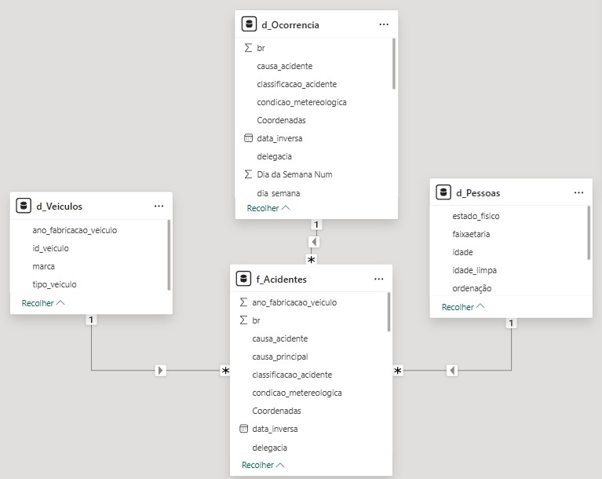
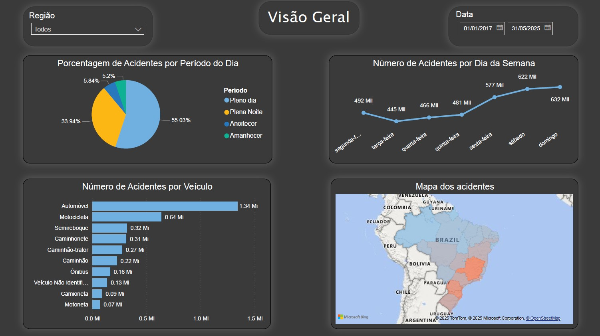
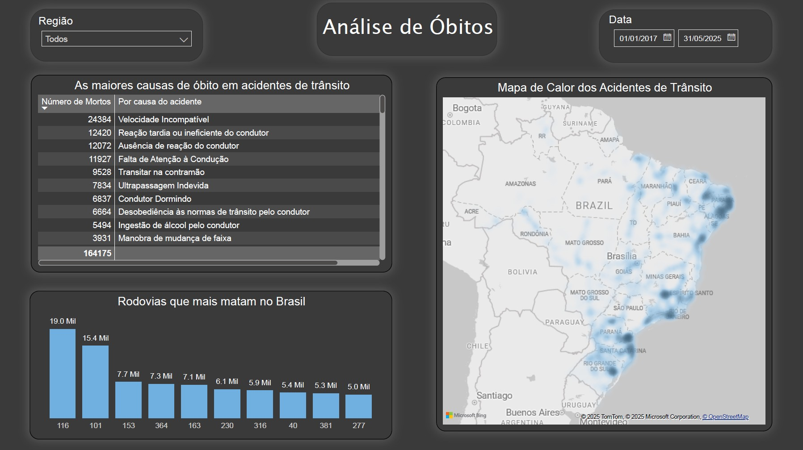
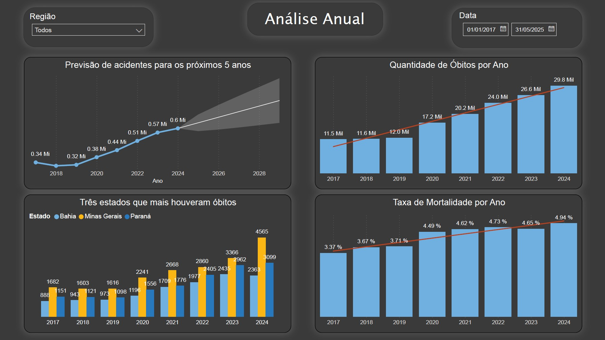
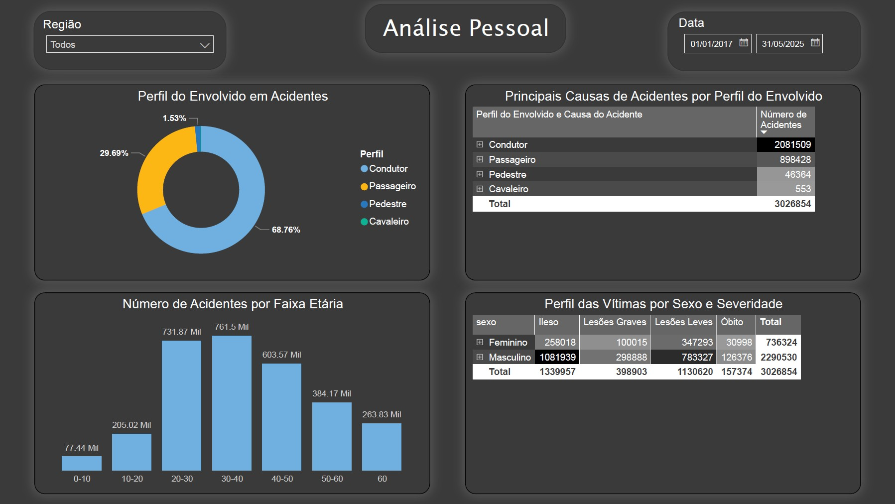

# Análise de Acidentes de Trânsito no Brasil (2017-2025)

### 🎬 Dashboard em Ação
  
*
Breve demonstração da interatividade dos filtros e visuais do dashboard.
*

---

### Resumo do Projeto
Este projeto realiza uma análise completa dos dados de acidentes de trânsito registrados pela Polícia Rodoviária Federal (PRF) entre 2017 e 2025. O objetivo foi limpar, modelar e visualizar os dados para identificar padrões, tendências e os principais fatores de risco associados a acidentes fatais e não fatais nas rodovias brasileiras. A modelagem foi estrturada em Modelo Estrela (Star Scheme) por causa da alta performance na consulta e sua análise ser mais intutiva.

### 🎥 Demonstração Completa em Vídeo
**Para uma análise detalhada e apresentação dos insights, assista à demonstração completa:**

**[▶️ Assistir Apresentação no YouTube (5 min)](https://youtu.be/9iuoat1K0Oo)**

### Perguntas Respondidas
O dashboard foi construído para responder a perguntas críticas, como:
1.  Quais são as principais veículos, locais e horários dos acidentes?
2.  Quais rodovias e causas de acidente apresentam maior risco de fatalidade?
3.  Qual é o histórico do número de acidentes ao longo dos anos e qual a previsão para o futuro?
4.  Qual o perfil demográfico (sexo, idade) das vítimas e sua relação com a severidade do acidente?

---

### Ferramentas Utilizadas
* **Power BI:** Para todo o processo de ETL, modelagem e visualização.
* **Power Query (Editor M):** Para limpeza, tratamento de erros, transformação e consolidação dos dados.
* **DAX:** Para a criação de medidas e colunas calculadas complexas (ex: Taxa de Mortalidade).

---

### Processo de ETL e Modelagem
Os dados brutos, provenientes de múltiplos arquivos anuais, passaram por um rigoroso processo de ETL no Power Query:
* **Consolidação:** Os arquivos CSV de 2017 a 2025 foram unidos em uma única base de dados. (f_Acidentes)
* **Limpeza:** Tratamento de valores nulos, erros de conversão e dados implausíveis (ex: idades > 110).
* **Transformação:** Criação de colunas personalizadas para enriquecer a análise, como `Faixa Etária`, `LocalizacaoCompleta` e colunas de ordenação.
* **Modelagem:** O modelo final foi estruturado utilizando o **Esquema Estrela**, com uma tabela fato (`f_Acidentes`) e três dimensões (`d_Ocorrencia`, `d_Pessoas`, `d_Veiculos`), garantindo performance e clareza nas análises.

#### Modelo de Dados (Esquema Estrela)

---

### Principais Dashboards e Insights

#### 1. Visão Geral

* **Insight 1:** Os fins de semana (sábado e domingo) concentram o maior volume de acidentes, muito provavelmente decorrente do maior número de pessoas transitando.
* **Insight 2:** Mais da metade dos acidentes (55%) ocorre durante o período de diurno, com grande foco em automóveis e este padrão se repete em diferentes anos.

#### 2. Análise de Óbitos

* **Insight 1:** "Velocidade Incompatível" e "Falta de Atenção à Condução" são as principais causas de acidentes fatais.
* **Insight 2:** As rodovias BR-116 e BR-101 se destacam com os maiores números de fatalidades no período analisado.
* **Insight 3:** A análise geográfica das fatalidades revela uma alta concentração de ocorrências nas regiões metropolitanas de Curitiba, Belo Horizonte e Recife.

#### 3. Análise Anual

* **Insight 1:** O número de acidentes continua a subir ano após ano e a previsão é que eles aumentem ainda mais.
* **Insight 2:** Tanto o número absoluto de óbitos quanto a taxa de mortalidade apresentam uma tendência de alta. Isso indica que os acidentes não apenas estão mais frequentes, mas também progressivamente mais letais.
* **Insight 3:** O estado-chave aparenta ser Minas Gerais, no qual, a partir de 2020 teve um aumento no número de fatalidades, com um pico em 2024, que registrou um aumento de 1.119 óbitos em relação a 2023. Apenas este aumento anual já supera o número total de óbitos registrados no estado em 2017, evidenciando a gravidade da situação

#### 4. Análise Pessoal

* **Insight 1:** Mais do que a metade (68%) do perfil envolvido em acidentes de transitos são condutores, seguidos por passageiros(29%).
* **Insight 2:** Quando correlacionado a causa do acidente com o perfil envolvido, podemos ver que as maiores causas de acidentes são atribuidas ao condutor (ex: Falta de atenção, excesso de velocidade).
* **Insight 3:** A faixa etária de 20 a 40 anos representa o grupo mais crítico, estes somando mais de 1.4 Milhões de acidentes de transito, este grupo de idade é seguido por aqueles entre 40-50 anos, que somam 603 Mil acidentes.
---

### 📂 Arquivo Fonte do Power BI (.pbix)
Devido ao tamanho do arquivo (277MB), o relatório fonte do Power BI está hospedado no Google Drive.

**[Clique aqui para baixar o arquivo .pbix via Google Drive](https://drive.google.com/file/d/1h38cj5MR65cn3l1LxkEjdk-qriF3fFkL/view?usp=sharing)**

### Contato
**[Luis César da Fonseca Pereira]** - [LinkedIn](https://www.linkedin.com/in/luis-cesar-pereira/) 
